# Omni-Narrative Engine — PlantUML Diagrams

You can render these diagrams using any PlantUML viewer, such as [PlantText](https://www.planttext.com/) or the PlantUML extension for VS Code.

---

## Figure 1: High-Level Conceptual Architecture

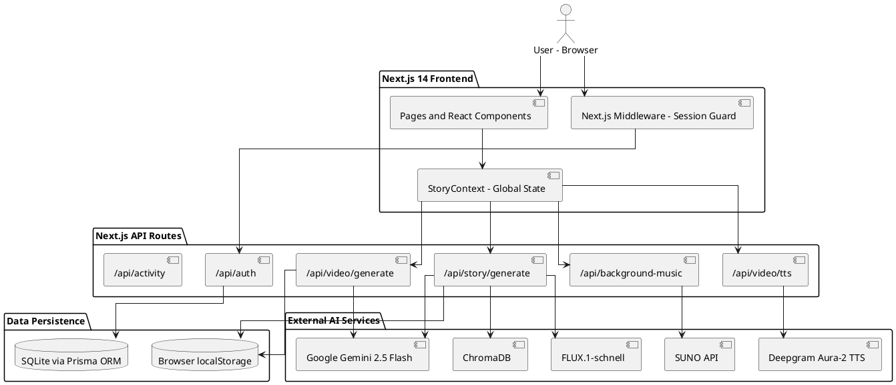

---

## Figure 2: Layered Architecture

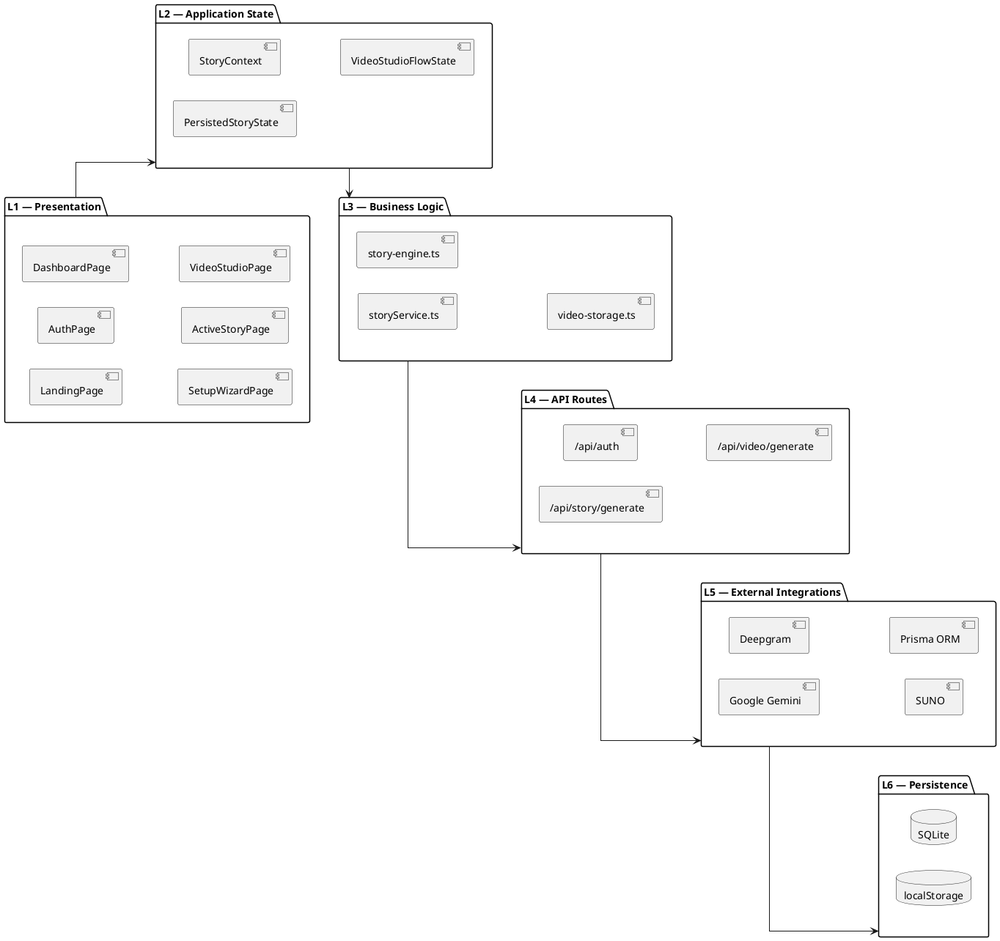

---

## Figure 3: AD-01 Story Setup and Mode Selection

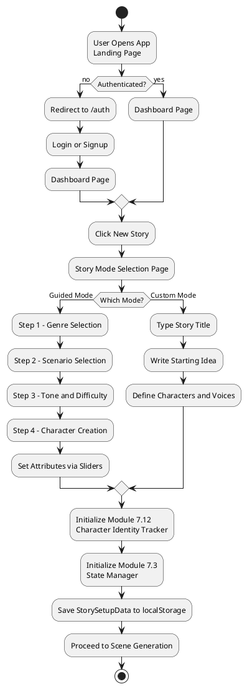

---

## Figure 4: AD-02 Custom Story Generation Flow

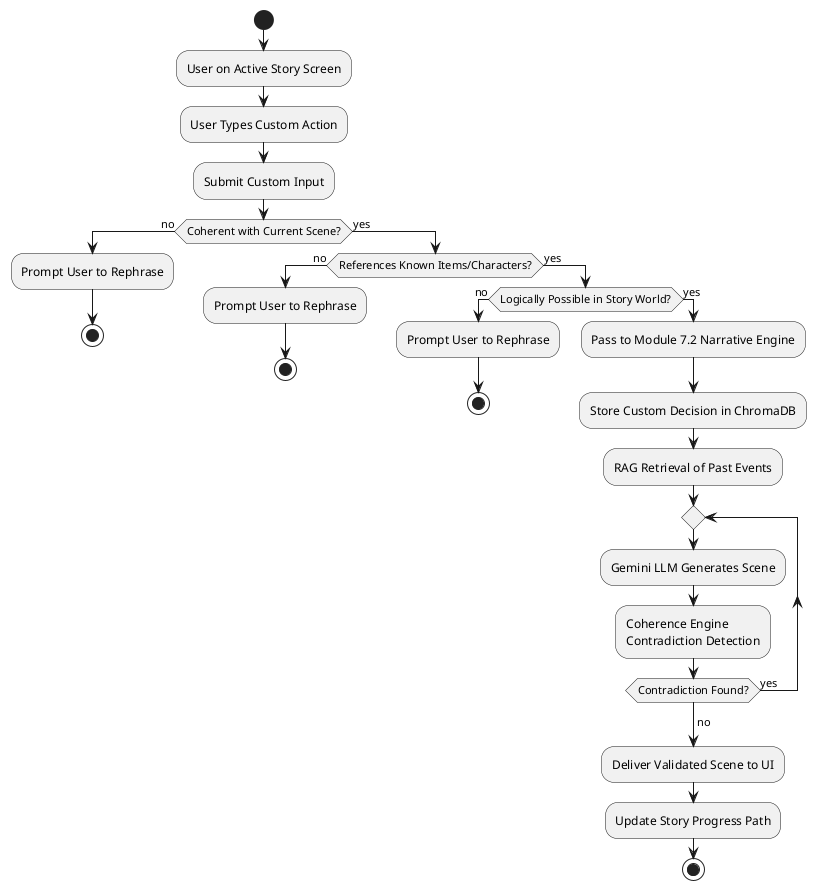

---

## Figure 5: AD-03 Scenario-to-Movie Generation

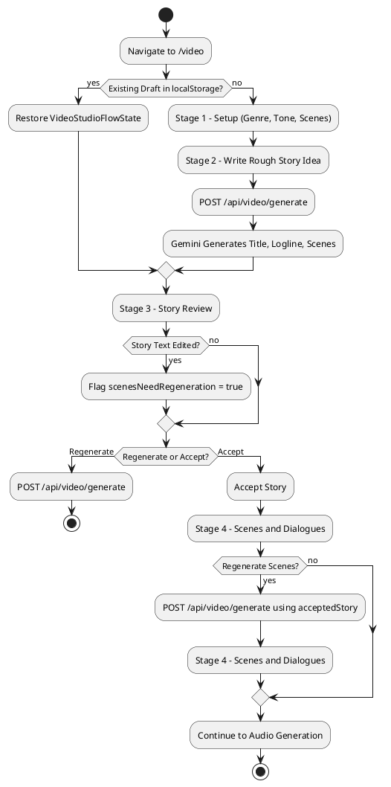

---

## Figure 6: AD-04 Voice and Background Music Flow

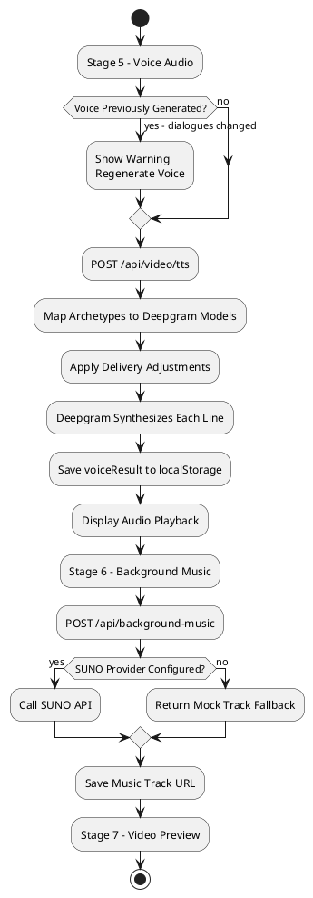

---

## Figure 7: AD-05 Active Story Loop

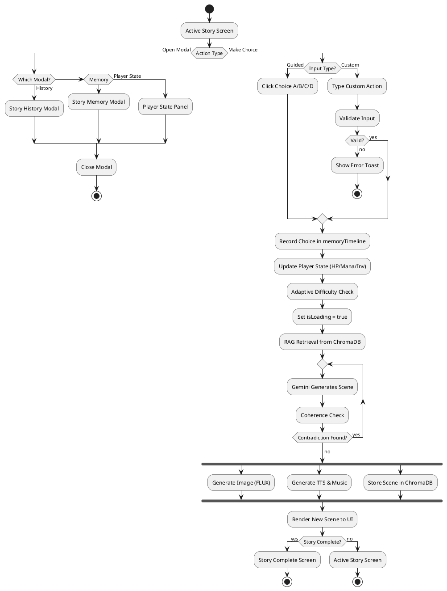

---

## Figure 8: SD-01 Custom Story Request

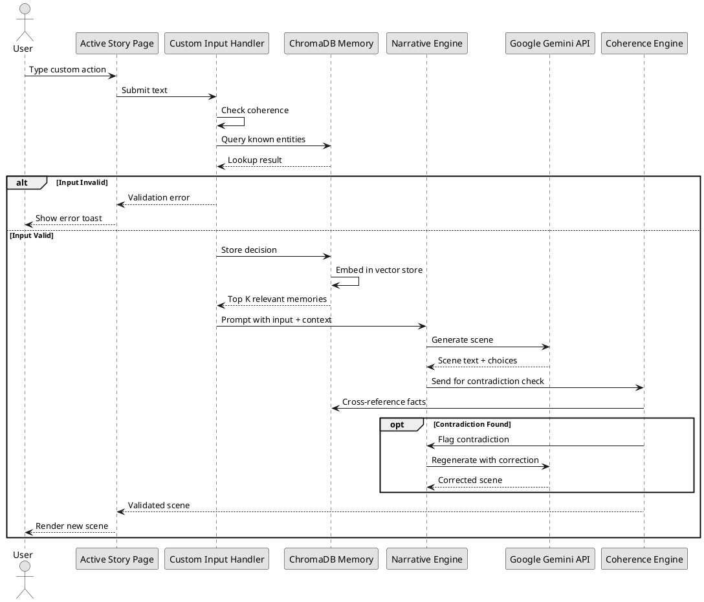

---

## Figure 9: SD-02 Video Generation and TTS

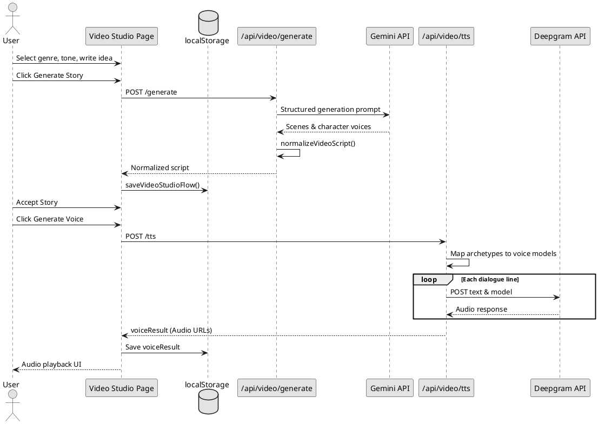

---

## Figure 10: SD-03 Background Music Request

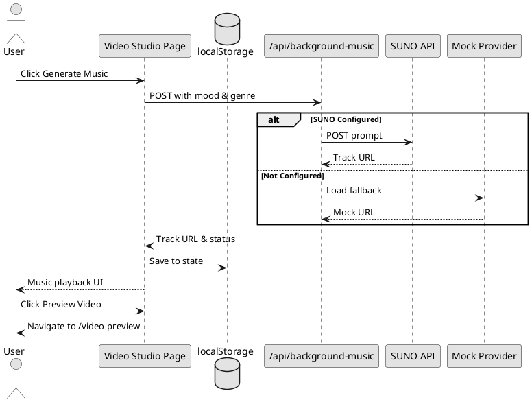

---

## Figure 11: SD-04 User Authentication

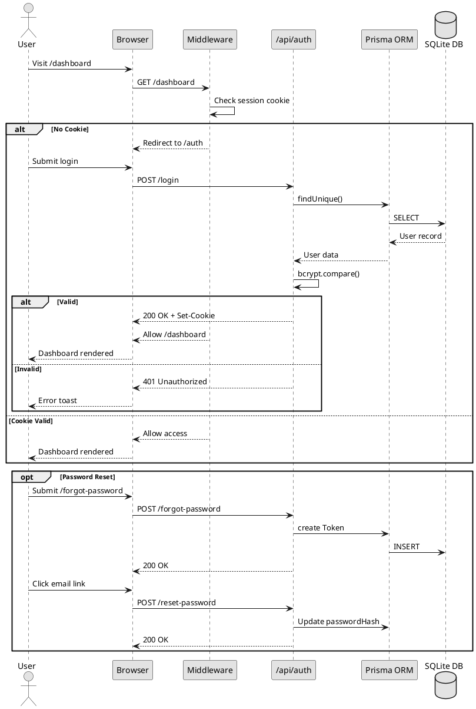

---

## Figure 12: STD-01 Story Session State Transition

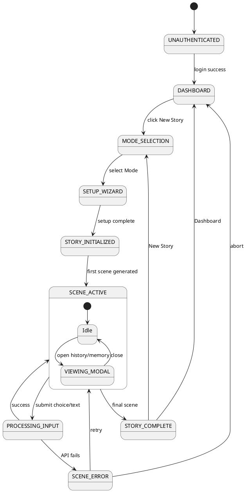

---

## Figure 13: STD-02 Video Studio State Transition

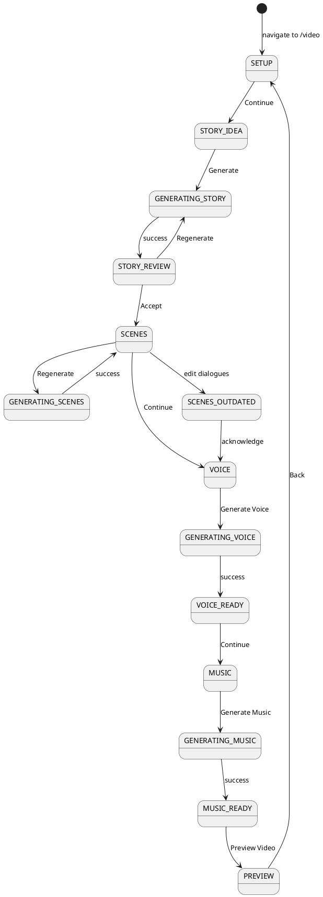

---

## Figure 14: STD-03 Authentication State Transition

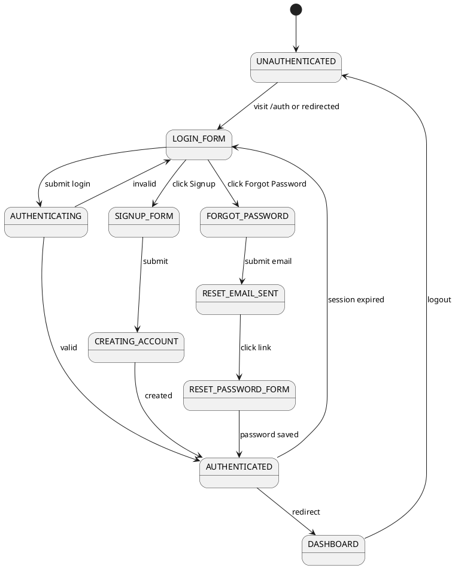

---

## Figure 15: ER Diagram: Supabase PostgreSQL Data Design

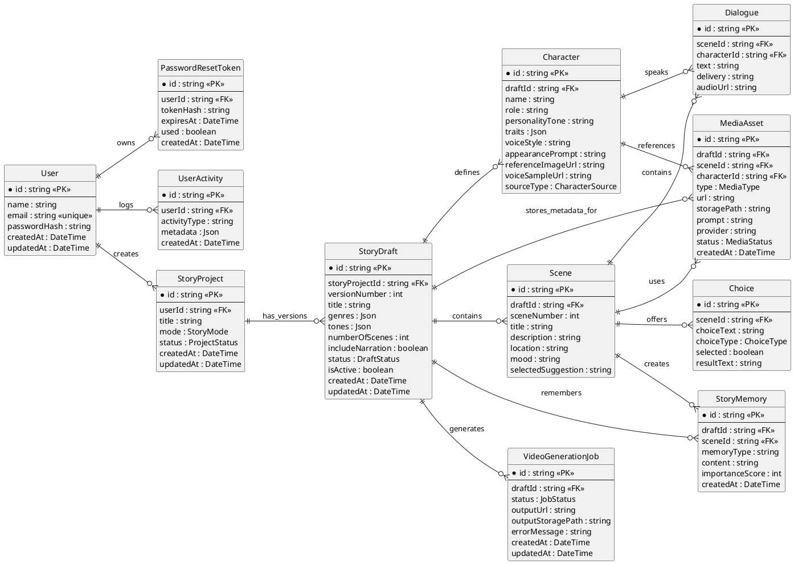

Notes:
- Supabase PostgreSQL stores relational data and metadata.
- Supabase Storage stores uploaded character images, voice samples, generated audio, generated images, and short video outputs.
- `StoryProject` to `StoryDraft` supports multiple drafts and version history.
- `Character.referenceImageUrl` supports camera/upload character appearance.
- `Character.voiceSampleUrl` supports personalized cloned voice generation.

---

## Figure 16: Class Diagram: Application Domain Design

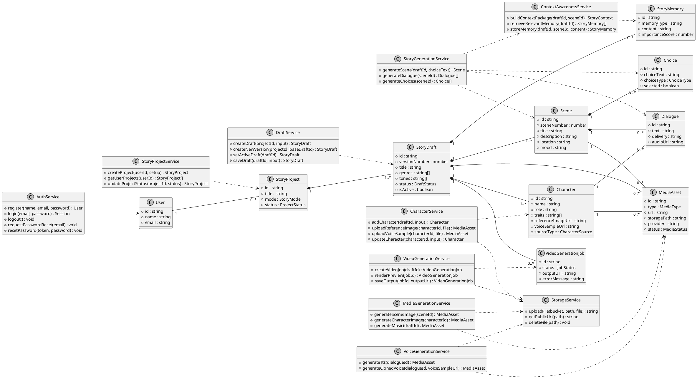
